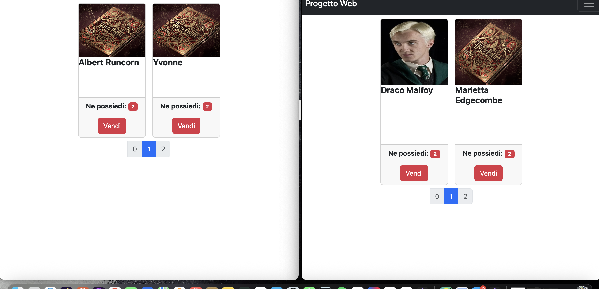
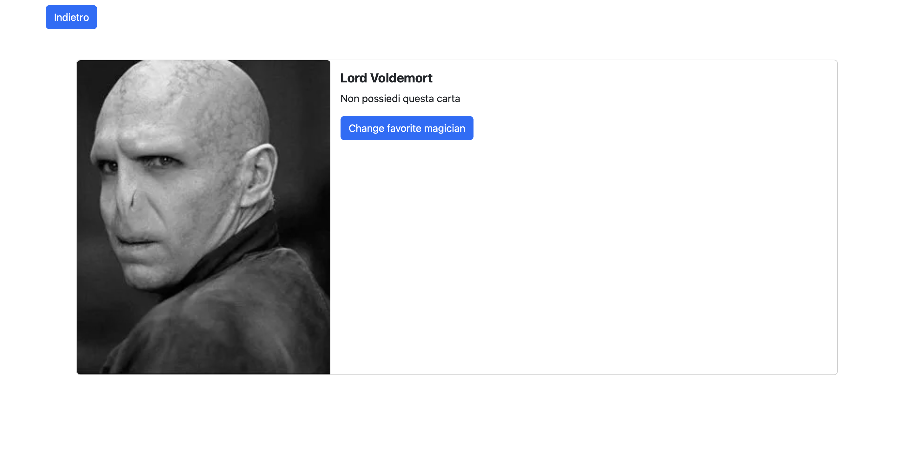

# Progetto tecnologie e linguaggi web

## Documentazione

Il progetto è una web app per la gestione di carte collezionabili ([maghi](https://hp-api.onrender.com/)), realizzata con Node.js, Express, MongoDB e frontend in HTML/JS/Bootstrap.

### Requisiti

- [Docker e Docker-Compose](https://docs.docker.com/get-started/) installati;
- [Node.js](https://nodejs.org/en/download) (per l'avvio senza Docker);
- [MongoDB](https://www.mongodb.com/docs/manual/installation/) (per l'avvio senza Docker);
- Connessione wifi (anche se con hosting locale) per poter effettuare il collegamento all'apposita API e a bootstrap.

### Avvio con Docker

1. scaricare il file

2. Eseguire i seguenti comandi nel terminale:
3. ``` cd <nome-directory> && docker-compose up --build ``` o semplicemente ```docker-compose up --build``` se già all'interno della directory, per avviare in background utilizzare ```docker-compose up -d --build```, eventuali log possono essere visualizzati successivamente attraverso i comandi presenti nell'apposita [Documentazione](https://docs.docker.com/reference/cli/docker/container/)

4. L'applicazione sarà disponibile su [http://localhost:3000](http://localhost:3000).


### Funzionalità implementate

- **Registrazione/Login**
- **Gestione carte**: visualizzazione, vendita, scambio carte maghi
- **Pacchetti**: acquisto, apertura e gestione pacchetti di carte
- **Profilo utente**: modifica dati, cambio password/email/username, scelta del mago preferito
- **Mercato**: offerte di scambio tra utenti

---

## Esempi di funzionamento

1. Login e registrazione:
    

    

    

    

2. Shop(monete e pacchetti):
    

    
	    Se non loggati si viene reindirizzati alla pagina di login in ambo i casi.

    
    I pacchetti acquistati sono disponibili all'apertura in una pagina dedicata, si possono aprire singolarmente o tutti insieme.

3. Scambio carte:
    
    Gli scambi presenti non possono essere effettuati se sloggati.

    
      Eventuali scambi possono essere creati ed eliminati, non si possono accettare i propri scambi.

    

    Quando uno scambio viene accettato in caso di esito positivo le carte vengono spostate tra gli utenti, qualsiasi errore (dovuto a carte doppie in richiesta o in offerta, o a problemi interni al server) porterà alla restituzione di tutte le carte.

    Es.
    
    
    

    Come possiamo vedere sotto, non possono essere creati scambi che hanno doppioni tra le carte richieste o tra quelle offerte.
    
    
    
    

4. album carte:
    
    
    Oltre all'album è presente una pagina che mostra tutte le carte disponibili.

    
    
    Eventuali carte possedute saranno mostrate con un pulsante per la vendita(si può vendere una carta singola ogni volta che il pulsante viene cliccato)

    
    
    Sia dall'album che dalla pagina delle carte presenti sul sito possiamo accedere ad alcune informazioni, ma solo se possediamo tali carte

    
    
    Per esempio, in questo caso non possediamo la carta, quindi l'immagine risulta grigia e le informazioni non vengono fornite.
    Possiamo però cambiare il nostro personaggio preferito indipendentemente dal fatto di possederlo o meno.

## API

L'API del sito è disponibile (successivamente al lancio dell'applicazione) [qui](http://localhost:3001/api-docs)
